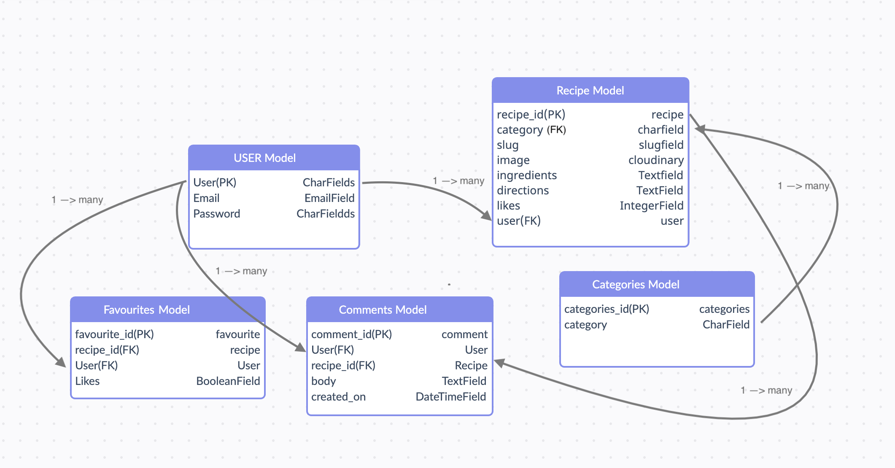

For the Love of Food - The food blog
==================================

* * *

ABOUT THE WEBSITE:
------------------

* * * 

[Link to deployed site](https://battlefields-blast.herokuapp.com/)

_For the Love of Food_ is a public online blog-styled platford where users can create a profile and digitalize their own recipes. Users can also view other users recipes, comment, like and favourite them! This interactive platform is designed to provide a a rich online community as users interact with each others recipe posts.

* * * 

## TARGET AUDIENCE:

* * *

The beauty of this platform, is that it targets anyone who has ever needed to set food in a kitchen. From the food lovers, to those finding a quick meal fix... "For the Love of Food" serves as your own digitalized cookbook. The advantage - this cookbook never ceases to grow and evolve.

*   Children 13+ (safe to be in a kitchen)
*   Adults

  
* * *

USER STORIES:
-------------

* * *

1. As a Site User I can view a paginated list of posts so that easily select a post to view.
2. As a Site User I can register an account so that I can View, post, comment, favourite and like recipes.
3. As a Site User I can click on a recipe post so that I can view its content.
4. As a Site User I can click the like button on a recipe so that I can like/unlike recipes.
5. As a Site User I can comment on a recipe so that I can interact with the content and other site users.
6. As a Site User I can favourite a recipe so that collect recipes to easily view them on my _Favourites Page_ when needed to.
7. As a Admin User I can create a recipe template so that site users can post their recipes easily.
8. As a Admin User I can Create, Read, Update and Delete recipes so that I can manage the sites content.
9. As a Admin/Site User I can view a list of recipes so that I can browse and select one to read.
10. As a Admin/Site User I can view the number of likes, favourites and posts so that I can track the recipe's popularity.
11. As a Admin User I can create, read, update and delete recipes so that I can manage the blog content.
12. As a user I can click on the favourites so I can view my list of favourite recipes.

* * * 

STRATEGY:
---------

* * *

Create an aesthetically pleasing and easy to navigate open source recipe database. The site is in the style of a Food Blog. It allows users to create their profile, and upload their own recipes from our recipe template. Users can also view and interact with other users recipes: liking, commenting and saving as favourites. Their favourites will all be displayed in their favourites page.

The site will allow for user authentification, and basic CRUD functionality.

The goal is to create a code that is clear and allows you to update with ease. 

* * * 

STRUCTURE:
----------

* * *

### Initial Home Page

* * *

*   LANDING PAGE: This is the page that initially loads when you first arrive at the site. 
    * Navbar: FontAweseom Icon & Home, Register, and Login.
    * Header: "For the Love of Food"
    * Search feature. !!!!!?????
    * You can immeditaley view the paginated list of recipe Posts (authenticated or not).

*   Depending on wether the user is authenticated and logged in or not navbar may display: 
    * FontAweseom Icon & Home, Register, and Login 
    * FontAweseom Icon & Home, Favourites, and Logout 
  

* * * 

### Recipe Details Page 

* * *

When user clicks a specific Recipe Post:

* Nav Bar and Header continues at the top.
* Recipe Title
* Recipe Category
* Recipe Author, date of publication and time.
* View number of likes, comments and favourotes. User may click on like and favourite button here.
* Recipe Image
* Ingredients
* Instructions
* Comments section below: user may view comments (oldest at the top, scrolling down to newest), and comment posting as user name.

* * * 
  
### Favourites Page 

* * *

When clicking favourites, the user can view all their favourite posts.

* NavBar and Header
* Sub-Header "Favourites"
* Paginated list of favourite posts. Similar to the landing home page.

* * * 

### Create Recipe Page

* * *

User can click on "Write my own Recipe" , which leads them to the following section..

* ^^^&&***(((((())))))
* !!!!
* !!!!!

  

## SKELETON:

-----------

### WIREFRAMES:

* * * 

## THE CODE:

* * *
Prior to commencing to write my code out, I planned out the ERD.

The User Model ---> Django default User Model. We will use user (PK), Email and Password.

Recipe Model --> Is our main model. It contains all the required fields for our recipe: recipe_id(PK), title, category(FK), slug, author(FK-User), created_on, image, ingredients, directions, likes, favourites, status and user. 

Categories Model --> Containing the categories_id(PK), category field.

Comments Model --> Containing, comment_id(PK), User(FK), recipe_id, body, created_on.

Favourites Model --> Contains favourtites_id, recipe_id, user, likes.

IMPORTANT RELATIONSHIPS BETWEEN TABLES:
* One to many relationship between the User and the Recipe model.
* One to many relationship between the User and the Favouries model.
* One to many relationship between the User and the Comments model.
* One to many relartionships between Category and Recipe's.
* One to many relationships between Recipe and Comments model.

* * * 

## SURFACE&&&&&&&&&&&&&&&&!!!!!!!!:

* * *
* When initially planning this game, I knew it would be clean, light and minimalistic. 
* The recipes should read easily, and the pop of color will come from the images and buttons.

* My initial wireframes...

* * *

### Colors

* * *

 When discovering more python packages, I decided to incorporate termcolor to add a pop of color to my terminal.
 I decided to go with a retro, 80's style console and incorporated a GREEN font.

* * * 

### Typography

* * *

Using the standard console typography: but played around with a few things
* Use of spacing in headers : H E A D E R
* Use of "************" for page break and separation

### Images and Icons

* * *

No use of images or icons.
Everything was built using letters, numbers, typographical symbols and punctuation to create the grid.

* * * 

FEATURES:
---------

* * *

### Current features

*   LANDING PAGE: This is the page that initially loads when you first arrive at the site. 
    * Navbar: FontAweseom Icon & Home, Register, and Login
    * Header: "For the Love of Food"
    * You can immeditaley view the paginated 

   
   

*   MENU: which loads once the user has input player name and it has been validated. The form takes the player's name and uses it below.
    * Header: M E N U
    * Personalised message to prepare for battle
    * 3 options:
        * Instructions - 1
        * Launch game - 2
        * Exit game - 3
    * Play input request: loops user input request until validated. I created a validating function to anticipate any errors the user may input:
        * Must be in a predetermined list with values: 1, 2, 3
        * Must be a digit
    

  

*   INSTRUCTIONS - when entering 1
    * Header: I N S T R U C T I O N S 
    * Listed game instructions in bullet points
    * Separated by spaces to make rules clearer.
    * Instruction to enter M - go back to menu
    * Player input request. (Validated before redirecting). This looped request until validation anticipates the following possible errors:
        * Must be 1 digit
        * Must be M only

  

* QUIT GAME - when entering 3 from MENU
    * Header: Q U I T  G A M E 
    * Message confirming if user wants to exit game. Language is challenging the user.
    * Question player. Quit game?
        * If Y - GAME OVER
        * If N - back to MENU
    * Player input request. (Validated before redirecting). This looped request until validation anticipates the following possible errors:
        * Must be alphabetical
        * Must be in predetermined list with values: Y, N

  

* GAME OVER - when entering Y from QUIT GAME
    * Message displaying G A M E  O V E R

  

* GRID SELECTION - when entering 2 from MENU
    * Message displaying G R I D  S I Z E
    * Options to select from:
        * 5 x 5 (easy)
        * 8 x 8 (medium)
        * 12 x 12 (hard)
    * Input request (validated before submitting). This looped request until validation anticipates the following possible errors:
        * Must be in a predetermined list with values: 5, 8, 12
        * Must be a digit

 

* LAUNCH GAME ROUND - after selecting grid size
    * Header: B A T T L E F I E L D
    * Battlefield Grid:
        * Rows: A B C D E ...
        * Columns: A B C D E ...
    * Input request: Enter row (validated before submitting)
    * Input request: Enter column (validated before submitting)
    Both cases, request is looped until validation anticipates the following possible errors:
        * Must be alphabetical
        * Must be in a predetermined list with values determined by a for loop with range(grid_size) which creates an alphabetical list to cover this range.

 

* AFTER SUBMITTING COORDINATES - results added!
    * Message confirming hit, miss, or repeated coordinate.
    * Options, launch next missile?
        * Y - yes (validated before submitting)
        * N - no (validated before submitting)
    * Player input request. (Validated before redirecting). This looped request until validation anticipates the following possible errors:
        * Must be alphabetical
        * Must be in predetermined list with values: Y, N

 

* 2nd ROUND ONWARDS...
    * Exactly the same as before but adding:
        * Missiles left! with each round that loops, the function adds 1 missile, and subtracts that value from the total missiles at the start.
        * X (sunk) or - (missed) on grid where the player has previously hit.

 
    

* END SCORE (Either after completing 15 rounds, or having sunk all ships)
    * Header: G A M E  O V E R 
    * Personalised message: You win or You lose!
    * Number of ships sank
    * Number of ships remaining
    * Options, play again?
        * Y - yes (validated before submitting)
        * N - no (validated before submitting)

 

* * * 

### Future features

* Include tutorial videos
* Online live streaming of recipes

* * * 

## LANGUAGES:

* * *

*   PYTHON
*   CSS
*   HTML
*   JavaScript

* * * 

## OTHER TECHNOLOGIES, FRAMEWORKS & LIBRARIES:

* * *

*   [Django](https://www.djangoproject.com/
*   [GitHub](https://github.com/)
*   [GitPod](https://www.gitpod.io/)
*   [Heroku](https://id.heroku.com/login)
*   [Stack Overflow](https://stackoverflow.com/)
*   [Code beautify](https://codebeautify.org/html-to-markdown)
*   [Balsamiq](https://balsamiq.com/wireframes/desktop/#)
*   [Pep8](http://pep8online.com/)
*   [Cloudinary](https://cloudinary.com/)
*   [PostgreSQL](https://www.postgresql.org/)
*   [Bootstrap](https://getbootstrap.com/)

* * * 

## TESTING, BUGS & FIXES:

* * *

For testing I used the following sources:

* * * 

### Tests

* * *

#### [Pep8](http://pep8online.com/)

Tested and no errors found.

* * *

#### Manual testing 

* * * 

Testing this game manually was a long and very detailed process. No errors were found.

* * *

INTRODUCTION: 
* The initial page loads correctly, with no problems displaying its content.
* Player name input form (required, and validated before submitting):
* Input must be validated. To do so, I created a function called input_player_name. This required the user to input an alphabetical string. Input will not be submitted if it is not this type of data. As seen below, it will not validate a digit, empty space or punctuation.

 
        
* This name is successfuly stored as a variable and used a number of times throughout the game. (As seen displayed below)

 

MENU: 
* which loads once the user has input player name and it has been validated. 
* Content is displayed clearly, and loads properly when inputting the correct Player_name data.
* The user must input one of the 3 options. Once again, this requires validating. To do so, I created a separate function called validate_key_numerical. In this function, we anticipate the following errors
    * Input is NOT a digit
    * Input is not one of the pre-determined valid keys listed under keys_123.
* Play input request: loops user input request until validated. I created a validating function to anticipate any errors the user may input:
* When testing, I can confirm that it works and the code will not accept anything other than digits 1, 2 and 3.

 
 
 
 

INSTRUCTIONS - 
* Can confirm that when inputting 1, user is directed to the correct section: Instructions.

 

* The content is displayed clearly in the terminal. You can see all information without having to scroll up or down.
* Player input request must be valid: To achieve this, I created one more function called validate_key_alpha that loops the request until it is valid. This function anticipated the following errors:
    * That the (data.isalpha()) is False
    * That the input is not one of the predetermined keys listed, in this case M only.
 
  
 
 

QUIT GAME: 
* No issues, redirects to this section as expected when entering 3 from MENU.
* Content is displayed clearly, and leaves for no ambiguity. 
* Question player. Quit game? - User input must be validated before proceeding. For this section, I used the same function validate_key_alpha. In this case, we anticipate the same errors:
    * That the (data.isalpha()) is False
    * That the input is not one of the predetermined keys listed, in this case the yes-no-keys list containing Y and N only. This is looped until validation. It has been tested and I can confirm it will accept nothing other than this.
  

  
  
  
  

GAME OVER: 
* When entering Y from QUIT GAME
* Message displaying G A M E  O V E R - no issues. Works as intended

  

GRID SELECTION:
* When entering 2 from MENU the user is directed to the grid selection as intended. 
* The information is displayed clearly. The user can choose between 3 grid sizes. Input must be validated.
* Options to select from:
    * 5 x 5 (easy)
    * 8 x 8 (medium)
    * 12 x 12 (hard)
* Input request (validated before submitting). This looped request until validation anticipates the following possible errors:
    * Must be in a predetermined list with values: 5, 8, 12
    * Must be a digit

* With manual testing, I can confirm this works as intended, and no errors occurred.

 
 
 

LAUNCH GAME ROUND: 
* After selecting grid size and the input being correctly validated.
* The information is all displayed correctly. When clicking on the grid size, the correct grid board is displayed. See below:

 
 
 

* When creating the board, the function to create the 5 random ship coordinates is triggered. By manually printing the ship-coordinate list we can confirm this works correctly.

 

* The coordinates generated must also work within the grid range. Through manual testing, I can confirm that depending on the grid size, all coordinates generated are within parameters.
    * For the 5 x 5 = cooridinates between 0 and 4 generated.
    * For 8 x 8 = coordinates between 0 and 7 generated
    * For 12 x 12 = coordinates between 0 and 11 generated

 
 
 

* Input request: Enter row (validated before submitting)
* Input request: Enter column (validated before submitting)
* In both cases, request is looped until validation anticipates the following possible errors:
    * Must be alphabetical
    * Must be in pre-determined list with values determined by a for loop with range(grid_size) which creates an alphabetical list to cover this range.
    
I can confirm that no errors come up. 
 
 

AFTER SUBMITTING COORDINATES:  
* Results added! Message confirming hit, miss, or repeated coordinate. With some manual testing carried out by temporarily printing the ship coordinates, I can confirm that when the user inputs the ship coordinates, an X is displayed on the grid. If it is not part of the list, a - is displayed. 
For reference - A = 0, B = 1, C = 2, D = 3, E = 4
* As you can see, (0,0)=(A,A) and (1,1)=(B,B) are ship locations. As they were entered by the user, we display an X in this position.
* (3,3)=(C,C) is not, therefore it is represented on the grid with a -.

 

OPTIONS: launch next misile?

* Content is displayed clearly, and leaves for no ambiguity. 
* Question player. Launch next? - User input must be validated before proceeding. For this section, I used the same function validate_key_alpha. In this case, we anticipate the same errors:
     * That the (data.isalpha()) is False
    * That the input is not one of the predetermined keys listed, in this case the same yes-no-keys list containing Y and N  only. This is looped until validation. It has been tested and I can confirm it will accept nothing other than this.
    * Y - yes (validated before submitting)
    * N - no (validated before submitting)
* Manual testing confirms this works, resulting in no errors.
* When entering Y - next missile will be launched. Requests new row coordinate.
* When entering N - quit game ?

 
   
* During testing, I can confirm that the correct message is displayed when :
    * matching coordinate - You sunk a ship!
    * Not matching - You missed!
    * Hitting a coordinate you have hit previously

 
 
 

END SCORE (Either after completing 15 rounds, or having sunk all ships): 
* Personalised message: You win or You lose! After having tested with many scenarios, I can confirm it displays the correct score.
    * Number of ships sank
    * Number of ships remaining

 
    
* The function will break once all 5 ships have been sunk regardless of how many missiles are left! 

 

OPTIONS, play again?

* Content is displayed clearly, and leaves for no ambiguity. 
* Question player. Play again? - User input must be validated before proceeding. For this section, I used the same function validate_key_alpha. In this case, we anticipate the same errors:
    * That the (data.isalpha()) is False
    * That the input is not one of the predetermined keys listed, in this case the same yes-no-keys list containing Y and N  only. This is looped until validation. It has been tested and I can confirm it will accept nothing other than this.
    * Y - yes (validated before submitting)
    * N - no (validated before submitting)

 

* After manual testing and some debugging, I can confirm that both the grid and the random ships coordinate are refreshed once starting the game again.

* * * 

###### BUGS & FIXES: 

* Loop for grid size selection. When testing this part, I noticed that when a ValueError occurred with user input, the loop would only re-loop the input section. It did not include the options that could be selected. This would mean that if still committing errors, the user would have to scroll up to gain clarification on grid size options. This was solved by changing the while True loop. I included the text into this loop. See below:

 
 

* While manually testing the random coordinates generated to create the ships, I noticed an error in my code. Because I had initially only created a 5 x 5 grid and I wanted to create 5 random ships, I had used the following using the int(grid_size). 

 
 
 

This was amended to while len(enemy_ship_coordinates) < 5:
I can confirm it now generates only 5 random coordinates for the ships.

 

* A significant bug I encountered was when finishing a game and wanting to launch the game again. The X's and -'s remained displayed on the board. Sean from Code Institute helped me solve this, and suggested I use the following code:
    
    
    

I can confirm after being manually tested, that the grid will refresh and an entire new set of ship-coordinates is generated after starting a new game.

* * * 

#### Unresolved bug 

* * * 
I would like to resolve the following issue. When sinking all 5 ships, the program still asks the user if they would like to launch a new misile. I would like to change this so that it goes straight to the SCORE section displayed VICTORY!

* * * 

#### Testing User Stories 

* * * 

1. The site is designed in a way that makes the game cool, strategic but easy to play.
Yes - the game is easy to navigate and easy to play. The simplistic design of the game and the grid makes it cool and fun for the user.

2. The game feels personal as the user can input their name and see it displayed throughout.
Yes - the user inputs their name, and it is then displayed throughout. It is done several time during the game. This allows the game to become personal!

3. The game instructions are clear and concise and can be easily accessed at the start of the game.
Yes - the instructions are displayed in bullet points. They are clear and straightforward. I have also arranged them in small sections to make them clearer.

4. The user can exit the game at any time.

Yes - there are many options for the user to exit game. They can exit from MENU by entering 3. They can then exit during the game rounds, by entering N. The user is also always required to confirm before exiting the game.

5. The game displays a cool, clear grid where the user can visually see their battlefield.
Yes - the grid is clear and cool. The green color makes adds to the retro 80's console feel I wanted to bring to the game

6. The game grid is updated with every round, visually portraying hits and misses, and the user is provided with valuable information: 
    1. Message confirming hit, miss or duplicate hit.
    2. Missiles left.
    3. Option to launch next missile or exit the game.
Yes - all of this is displayed through-out each round. It is clear and easy to read!

7. The user will want to play again and again!

* * *

## DEPLOYMENT:

* * *

### Forking The GitHub Repository

* * *

You can Fork the Repository. This makes a copy of the original repository on our Github account so you can make changes without affecting the original repository.
1. Log into GitHub and locate the GitHub repository you want.
2. Click on the "Fork" button which is located in the top right corner.
3. You will now have a copy of the original repository in your GitHub account.

* * * 

### Cloning the Project.
* * *
1. Log into GitHub and locate the GitHub repository you want.
2. Under the repository name, click "Code" button which will come up with a dropdown menu.
3. Where it says Clone, copy the link below.

* * * 

### Using Code Institute's mock terminal for Heroku

* * *

This site was deployed using the following steps:

1. Make sure that the project has been created using Code Institute Python template.
2. Make sure all python scripts have a new line character at the end of the text inside.
3. With installing packages type in command: 'pip3 freeze > requirements.txt'. This will allow them to work in Heroku, and the Code Institute template will be updated automatically.
4. Commit and push changes to GitHub
5. Create Heroku Account
6. In Heroku dashboard: go to Create new app.
7. Give your app a unique name
8. Select region
9. Click create App.
10. Go to the Settings tab, scroll down to Config Vars and select Reveal Config Vars.
11. Confid Vars enter:
    1. Key: PORT
    2. Value: 8000
12. Go to Buildpacks and click Add Buildpack.
13. Select Python and save changes.
14. Add NodeJS and save changes (Python on top and NodeJS below. You can drag the to re-order)
15. Scroll to Deploy Tab, select Github and confirm Connect to Github.
16. Search for your repository and click Connect.
17. Select Deploy Branch and deploy in master/main.
18. Your deployed app is live!

[Link to deployed site](https://battlefields-blast.herokuapp.com/)

* * *

CREDITS: 
--------

* * *

### Content & Code
* A couple of the code institute tutors helped me with some issues I was having. 
    * I encountered a bug: When finishing a game and wanting to launch game again, my X's and -'s remained displayed on the board. Sean from Code Institute helped me solve this, and suggested I use the following code:
    
    
    

* Coming up with how to create my grid was a challenge! After brainstorming, I researched a few different ways people had achieved this. Some of the tutorials I looked at:
    * [Code Academy](https://discuss.codecademy.com/t/excellent-battleship-game-written-in-python/430605)
    * [Python for begginers](https://bigmonty12.github.io/battleship)       
    * [Stack Exchange](https://codereview.stackexchange.com/questions/122970/python-simple-battleship-game)
* My peers at Code Institute Slack were also incredibly helpful!
* My mentor Chris helped me better understand how to best validate my code.

       

