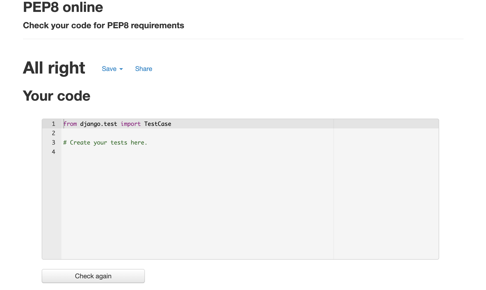

For the Love of Food - The food blog
==================================

* * *

ABOUT THE WEBSITE:
------------------

* * * 

[Link to deployed site](https://for-the-love-of-food1.herokuapp.com/)

_For the Love of Food_ is a public online blog-styled platford where users can create a profile and digitalize their own recipes. Users can also view other users recipes, comment, like and favourite them! This interactive platform is designed to provide a a rich online community as users interact with each others recipe posts.

* * * 

## TARGET AUDIENCE:

* * *

The beauty of this platform, is that it targets anyone who has ever needed to set food in a kitchen. From the food lovers, to those finding a quick meal fix... "For the Love of Food" serves as your own digitalized cookbook. The advantage - this cookbook never ceases to grow and evolve.

*   Children 13+ (safe to be in a kitchen)
*   Adults

  
* * *

USER STORIES:
-------------

* * *

1. As a Site User I can view a paginated list of posts so that easily select a post to view.
2. As a Site User I can register an account so that I can View, post, comment, favourite and like recipes.
3. As a Site User I can click on a recipe post so that I can view its content.
4. As a Site User I can click the like button on a recipe so that I can like/unlike recipes.
5. As a Site User I can comment on a recipe so that I can interact with the content and other site users.
6. As a Site User I can favourite a recipe so that collect recipes to easily view them on my _Favourites Page_ when needed to.
7. As a Admin User I can create a recipe template so that site users can post their recipes easily.
8. As a Admin User I can Create, Read, Update and Delete recipes so that I can manage the sites content.
9. As a Admin/Site User I can view a list of recipes so that I can browse and select one to read.
10. As a Admin/Site User I can view the number of likes, favourites and posts so that I can track the recipe's popularity.
11. As a Admin User I can create, read, update and delete recipes so that I can manage the blog content.
12. As a user I can click on the favourites so I can view my list of favourite recipes.

* * * 

STRATEGY:
---------

* * *

Create an aesthetically pleasing and easy to navigate open source recipe database. The site is in the style of a Food Blog. It allows users to create their profile, and upload their own recipes from our recipe template. Users can also view and interact with other users recipes: liking, commenting and saving as favourites. Their favourites will all be displayed in their favourites page.

The site will allow for user authentification, and basic CRUD functionality.

The goal is to create a code that is clear and allows you to update with ease. 

* * * 

STRUCTURE:
----------

* * *

### Initial Home Page

* * *

*   LANDING PAGE: This is the page that initially loads when you first arrive at the site. 
    * Navbar: FontAweseom Icon & Home, Register, and Login.
    * Header: "For the Love of Food"
    * Search feature. !!!!!?????
    * You can immeditaley view the paginated list of recipe Posts (authenticated or not).

*   Depending on wether the user is authenticated and logged in or not navbar may display: 
    * FontAweseom Icon & Home, Register, and Login 
    * FontAweseom Icon & Home, Favourites, and Logout 
  

* * * 

### Recipe Details Page 

* * *

When user clicks a specific Recipe Post:

* Nav Bar and Header continues at the top.
* Recipe Title
* Recipe Category
* Recipe Author, date of publication and time.
* View number of likes, comments and favourotes. User may click on like and favourite button here.
* Recipe Image
* Ingredients
* Instructions
* Comments section below: user may view comments (oldest at the top, scrolling down to newest), and comment posting as user name.

* * * 
  
### Favourites Page 

* * *

When clicking favourites, the user can view all their favourite posts.

* NavBar and Header
* Sub-Header "Favourites"
* Paginated list of favourite posts. Similar to the landing home page.

* * * 

### Create Recipe Page

* * *

User can click on "Create Recipe" , which leads them to the following section..

* NavBar and Header
* Sub-Header "Favourites"
* Form to fill out creating recipe.

  

## SKELETON:

-----------

### WIREFRAMES:

* * * 

## THE CODE:

* * *
Prior to commencing to write my code out, I planned out the ERD.

The User Model ---> Django default User Model. We will use user (PK), Email and Password.

Recipe Model --> Is our main model. It contains all the required fields for our recipe: recipe_id(PK), title, category(FK), slug, author(FK-User), created_on, image, ingredients, directions, likes, favourites, status and user. 

Categories Model --> Containing the categories_id(PK), category field.

Comments Model --> Containing, comment_id(PK), User(FK), recipe_id, body, created_on.

Favourites Model --> Contains favourtites_id, recipe_id, user, likes.

IMPORTANT RELATIONSHIPS BETWEEN TABLES:
* One to many relationship between the User and the Recipe model.
* One to many relationship between the User and the Favouries model.
* One to many relationship between the User and the Comments model.
* One to many relartionships between Category and Recipe's.
* One to many relationships between Recipe and Comments model.

* * * 

## SURFACE

* * *
* When initially planning this site, I knew it would be clean, light and minimalistic. 
* The recipes should read easily, and the pop of color will come from the images and perhaps a few buttons. Most would be in black and white.

* My initial wireframes...

* * *

### Colors

* * *

Mostly white, black, grey and a pop of green in afew buttons. Most of the color will come from the images uploaded by uses. 

* * * 

### Typography

* * *

Light, spaced, delicate and clean font. 
*  Montserrat
*  Use of letter-spacing

### Images and Icons

* * *

Use of a few font-awesome black icons to add some charater.
Still very minimalistic!

* * * 

FEATURES:
---------

* * *

### Current features

*   HOME PAGE: (index.html) This is the page that initially loads when you first arrive at the site. 
    * Navbar: FontAweseom Icon & Home, Register, and Login
    * Header: "For the Love of Food"
    * You can immeditaley view the recipes listed. 
    * Without having set up an authenticated user log, the user can view the recipe details. They can just click on the title and will be redirected to the recipe_detail.html page.

  

*   RECIPE DETAIL: (recipe_detail.html) User can view the recipe details. 
    * Navbar: FontAweseom Icon & Home, Register, and Login
    * Header: "For the Love of Food"
    * Recipe Title
    * Recipe Category
    * Recipe author / Created_on date and time
    * Like button (and number of likes), Comments image (and number of comments), favourite button (and number of favourites)
    * Recipe ingredients
    * Recipe Image
    * Recipe instructions
    

*   REGISTER - (account/signup.html)
    * Navbar: FontAweseom Icon & Home, Register, and Login
    * Header: "For the Love of Food"
    * Sign Up Title - and instructions to sign in if you already have an account.
    * Input fields:
        * Username
        * Email (optional)
        * Passoword
        * Passoword (again)
        * Submit button --> Sign Up

  

 When registered and logged in you will be able to view the following in the nav bar: Home, Favourites, Drafts, Logout, Create Recipe, and the listed recipes.
 Before this you will only see: Home, Register, and Login.

* LOGIN - (account/login.html)
    * Navbar: FontAweseom Icon & Home, Register, and Login
    * Header: "For the Love of Food"
    * Sign IN Title - and instructions to register if you haven't already got an account.
    * Input fields:
        * Username
        * Email (optional)
        * Remember me optional checkbox (optional)
        * Submit button --> Sign In

  

When logged in you will be able to view the following in the nav bar: Home, Favourites, Drafts, Logout, Create Recipe, and the listed recipes.

* LOGOUT - (account/logout.html)
    * Navbar: FontAweseom Icon & Home, Register, and Login
    * Header: "For the Love of Food"
    * Sign OUT Title 
    * Message - are yu sure you wnat to sign out?
    * Submit button --> Sign Out

  
 
 Once logged out you will only bew able to view: Home, Register, and Login.

* FAVOURITES - (recipe_favourites.html) -> This is the page that will load, from an authenticated logged in user, when clicking on Favourites.
    * Navbar: FontAweseom Icon & Home, Register, and Login
    * Header: "For the Love of Food"
    * You can immeditaley view the favourited recipes by this user. 
    * User cna click onto the recipe title to get the recipe details.

  

* DRAFTS - (recipe_drafts.html) -> This is the page that will load, from an authenticated logged in user, when clicking on Drafts. It will display all the recipes that have not been published yet.
    * Navbar: FontAweseom Icon & Home, Register, and Login
    * Header: "For the Love of Food"
    * You can immeditaley view the drafted recipes by this user. 
    * User can click onto the recipe title to get the recipe details.

 

* CREATE RECIPE - (create_recipe.html) - this is the page where autheticated users can create their own recipe, filling in a simple form.
    * Navbar: FontAweseom Icon & Home, Register, and Login
    * Header: "For the Love of Food"
    * Create your Recipe - sub header 
    * Form: fields (title, category, author, ingredients, instructions, image, status)
    * Post button.

* EDIT RECIPE - (update_recipe.html) - this is the page where autheticated users can edit their own recipe, filling in a simple form. User can only edit the posts they created!
    * Navbar: FontAweseom Icon & Home, Register, and Login
    * Header: "For the Love of Food"
    * Edit your Recipe - sub header 
    * Form: fields (title, category, author, ingredients, instructions, image, status)
    * Post button.
    * Delete recipe button
    

 
 

    

* DELETE RECIPE - (delete_recipe.html) - this is the page where autheticated users can delet their own recipe. User can only delete the posts they created! This pops up after clicking on the delete this post button on the edit_recipe.html
    * Navbar: FontAweseom Icon & Home, Register, and Login
    * Header: "For the Love of Food"
    * Delete your Recipe - sub header 
    * Security: are you sure you want to delete this recipe?
    * Delete button.

 

* * * 

### Future features

* Prepopulated author of recipe = authenticated user name. This prevents the user to be able to use someone else's name as author. 
* When creating recipe, the user can either input the category or sleect one from the dropdown menu. At the moment the user is limited to selecting from a limited amount.

* * * 

## LANGUAGES:

* * *

*   PYTHON
*   CSS
*   HTML
*   JavaScript

* * * 

## OTHER TECHNOLOGIES, FRAMEWORKS & LIBRARIES:

* * *

*   [Django](https://www.djangoproject.com/)
*   [GitHub](https://github.com/)
*   [GitPod](https://www.gitpod.io/)
*   [Heroku](https://id.heroku.com/login)
*   [Stack Overflow](https://stackoverflow.com/)
*   [Code beautify](https://codebeautify.org/html-to-markdown)
*   [Balsamiq](https://balsamiq.com/wireframes/desktop/#)
*   [Pep8](http://pep8online.com/)
*   [Cloudinary](https://cloudinary.com/)
*   [PostgreSQL](https://www.postgresql.org/)
*   [Bootstrap](https://getbootstrap.com/)

* * * 

## TESTING, BUGS & FIXES:

* * *

For testing I used the following sources:

* * * 

### Tests

* * *

#### [Pep8](http://pep8online.com/)

Tested and no errors found.

urls.py

forms.py

admin.py

apps.py

views.py

models.py

tests.py

asgi.py

settings.py

A couple of long lines, but I am unable to make them any shorter.
urls.py

wsgi.py

#### [HTML VALIDATOR](https://validator.w3.org/)

Tested and no errors found!

This was easily solved by changing my alt value to -Image of recipe.

#### [CSS VALIDATOR](https://jigsaw.w3.org/css-validator/)

style.css
NO ERRORS FOUND!

summernote.css
NO ERRORS FOUND!

* * *

#### Manual testing 

* * * 

Testing this site manually was a long and very detailed process. No errors were found.

* * *

* * * 

###### BUGS & FIXES: 

* 

* * * 

#### Unresolved bug 

* * * 
I would like to resolve the following issue. 

* When creating recipe, the user can only select an option from a dropdown meny that has been preset. They cannot add their own category (in the case that they needed to).

* * * 

#### Testing User Stories 

* * * 

1. As a Site User I can view a paginated list of posts so that easily select a post to view.

2. As a Site User I can register an account so that I can View, post, comment, favourite and like recipes.

3. As a Site User I can click on a recipe post so that I can view its content.

4. As a Site User I can click the like button on a recipe so that I can like/unlike recipes.

5. As a Site User I can comment on a recipe so that I can interact with the content and other site users.

6. As a Site User I can favourite a recipe so that collect recipes to easily view them on my _Favourites Page_ when needed to.

7. As a Admin User I can create a recipe template so that site users can post their recipes easily.

8. As a Admin User I can Create, Read, Update and Delete recipes so that I can manage the sites content.

9. As a Admin/Site User I can view a list of recipes so that I can browse and select one to read.

10. As a Admin/Site User I can view the number of likes, favourites and posts so that I can track the recipe's popularity.

11. As a Admin User I can create, read, update and delete recipes so that I can manage the blog content.

12. As a user I can click on the favourites so I can view my list of favourite recipes.

* * *

## DEPLOYMENT:

* * *

### Forking The GitHub Repository

* * *

You can Fork the Repository. This makes a copy of the original repository on our Github account so you can make changes without affecting the original repository.
1. Log into GitHub and locate the GitHub repository you want.
2. Click on the "Fork" button which is located in the top right corner.
3. You will now have a copy of the original repository in your GitHub account.

* * * 

### Cloning the Project.
* * *
1. Log into GitHub and locate the GitHub repository you want.
2. Under the repository name, click "Code" button which will come up with a dropdown menu.
3. Where it says Clone, copy the link below.

* * * 

### SETTING UP DJANGO PROJECT & DEPLOYMENT

* * *
#### SETTING UP THE DJANGO PROJECT...

In GITHUB: Once the repository has been created using the Code Institute student template....

1. Install Django and supporting libraries. 
    * Django and gunicorn --> pip3 install 'django<4' gunicorn
    * Supporting libraries --> pip3 install dj_database_url psycopg2
    * Cloudinary libraries --> pip3 install dj3-cloudinary-storage

2. Create a requirements file --> pip3 freeze --local > requirements.txt

3. Create your project: in this case for-the-love-of-food

4. Create an app using command --> python3 manage.py startapp APP_NAME

5. Add it to installed apps --> INSTALLED_APPS = [
    …
    'APP_NAME',
]

6. Save file and migrate changes using command --> python3 manage.py migrate

7. Run server to test

8. Commit and push changes to github

#### DEPLOYING THE APP TO HEROKU...

1. Create Heroku Account
2. In Heroku dashboard: go to Create new app.
3. Give your app a unique name.
4. Select region --> EUROPE
5. Click create App.
6. Go to Database App/Resources/ Add-ons and search and click 'Heroku Postgres'.
7. Go to the Settings tab, scroll down to Config Vars and select Reveal Config Vars and copy text.

IN GITPOD...

8. Create env.py file on top of level directory.
9. Import os library
10. set environment variables --> os.environ["DATABASE_URL"] = "Paste in Heroku DATABASE_URL Link"
11. Add in a secret key --> os.environ["SECRET_KEY"] = "Make up your own randomSecretKey"

IN HEROKU ...

12. Add secret Key to config vars --> SECRET_KEY, “randomSecretKey”

IN GITPOD / IN SETTINGS.PY

13. Reference env.py file -->
import os
import dj_database_url

if os.path.isfile("env.py"):
   import env

14. Remove the secret key and replace it with the following variable--> SECRET_KEY = os.environ.get('SECRET_KEY')

15. Comment out the DataBases section -->
 DATABASES = {
     'default': {
         'ENGINE': 'django.db.backends.sqlite3',
         'NAME': BASE_DIR / 'db.sqlite3',
     }
 }

 16. Add new database section -->
 DATABASES = {
   'default': dj_database_url.parse(os.environ.get("DATABASE_URL"))
}

17. In the terminal, save files and make migrations --> python3 manage.py migrate

GETTING STATIC AND MEDIA FILES STORED ON CLOUDINARY...

18. Create a cloudinary account, and copy the CLOUDINARY_URL from the dashboard.

19. Add url to env.py -->
os.environ["CLOUDINARY_URL"] = "cloudinary://************************"

BACK IN HEROKU ...

20. Paste Cloudinary URL to Heroku Config Vars -->
Add to Settings tab in Config Vars e.g. COUDINARY_URL, cloudinary://************************

21. In config vars, add DISABLE_COLLECTSTATIC, 1. This will be rmeoved before final deployment.

IN GITPOD / SETTINGS.PY

22. Install Cloudinary libraries -->
INSTALLED_APPS = [
    …,
    'cloudinary_storage',
    'cloudinary',
    …,
]

23. Tell Django to use Cloudinary to store media and static files -->
STATIC_URL = '/static/'

STATICFILES_STORAGE = 'cloudinary_storage.storage.StaticHashedCloudinaryStorage'
STATICFILES_DIRS = [os.path.join(BASE_DIR, 'static')]
STATIC_ROOT = os.path.join(BASE_DIR, 'staticfiles')

MEDIA_URL = '/media/'
DEFAULT_FILE_STORAGE = 'cloudinary_storage.storage.MediaCloudinaryStorage'

23. Link file to templates -->
TEMPLATES_DIR = os.path.join(BASE_DIR, 'templates')

24. Change template directory to templates array -->
TEMPLATES = [
    {
        …,
        'DIRS': [TEMPLATES_DIR],
       …,
            ],
        },
    },
]

25. Add heroku hostname to ALLOWED_HOSTS-->
ALLOWED_HOSTS = ["PROJ_NAME.herokuapp.com", "localhost"]

IN GITPOD...

26. Create 3 new folders: media, static and templates

27. Create procfile and add code -->
web: gunicorn PROJ_NAME.wsgi

28. In terminal --> Add, Commit and Push

IN HEROKU ...

29. Deploy manually -->  Github as deployment method, on main branch

#### FINAL PRODUCTION DEPLOYMENT..

IN GITPOD / SETTINGS.PY 
1. Set DEBUG flag to False!! If not...
    * Django will serve the static  files such as css files itself, instead of relying on Cloudinary.
    * Django will continue to give us verbose error pages which can reveal credentials, and things you want to keeo secret. This will compromise your site!
2. Add a few more settings--> X_FRAME_OPTIONS = 'SAMEORIGIN'
    * Without this our summer note editor would no  longer work when we deploy the project. This is due to Cross-Origin Resource Sharing, which tells the browser which resources are permitted to be loaded.
3. Save, add and commit as "deployment commit", and push to github.

IN HEROKU...

4. In reveal config vars, remove DISABLE_COLLECTSTATIC environment variable.

5. Go to deploy tab, scroll down to the end and deplopy our branch! 

6. Your app has been deployed to heroku!

### Forking The GitHub Repository

* * *

You can Fork the Repository. This makes a copy of the original repository on our Github account so you can make changes without affecting the original repository.
1. Log into GitHub and locate the GitHub repository you want.
2. Click on the "Fork" button which is located in the top right corner.
3. You will now have a copy of the original repository in your GitHub account.

* * * 

### Cloning the Project.
* * *
1. Log into GitHub and locate the GitHub repository you want.
2. Under the repository name, click "Code" button which will come up with a dropdown menu.
3. Where it says Clone, copy the link below.

* * * 

[Link to deployed site](https://for-the-love-of-food1.herokuapp.com/)

* * *

CREDITS: 
--------

* * *

### Content & Code

This project was extremely challengin for me. I used several resources to get me to the finish line, as well as the help of tutors, my mentor and fellow students at Code Institute.

* I used the "I think therefore I blog" walk through project as a starting point and template. As per this walktrhiugh projects, I created a blog like page that stored recipes. I used some snippets of code as reference, and nbuilt upon it with more features. (Such as favourites view, create recipe view, edit and delete, and drafts view).
* Oisin (tutor) in Code Institute helped me troubleshoot some issues I was having with my cloudinary images not loading onto my site. 
* Alan (tutor) in Code Institute helped me troubleshoot some issues I was having with fontawesome icons. Thanks!
* Sean (tutor) at Code Instutute helped me troubleshoot an error I was getting when connecting my urls for creating a recipe.
* Matt (a former Code Instutute student) helped me toroubleshoot an issue I was having with displaying summernotes from the front end, and my cloudinary image not updating wehen editing my form. Thank you Matt!!!
* Chris (my mentor) helped me plan out the project and supported me every step of the way.
* Codemy.com --> I followed a few tutorials to get ideas as how to create/edit/delete my recipe blog posts. https://www.youtube.com/watch?v=J7xaESAddDQ

       

